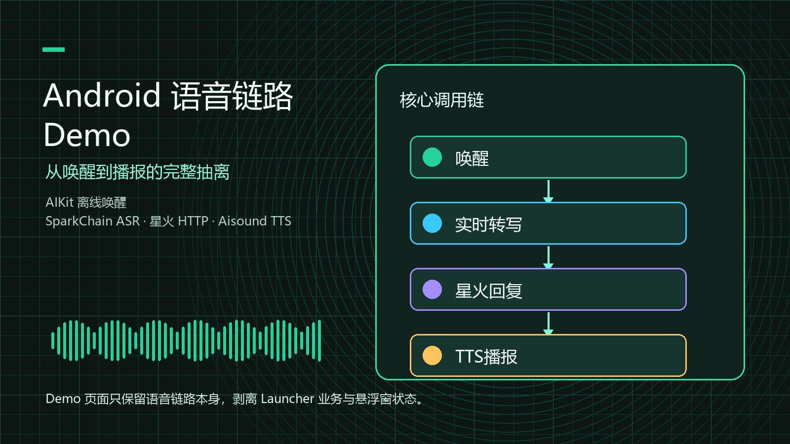
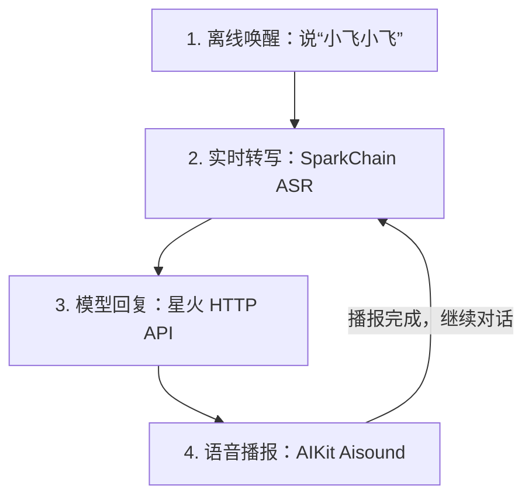

# Voice Pipeline Demo



这是一个独立的 Android 语音对话 Demo，从 `robot` 工程中抽离而来。它只保留一条可运行的语音链路：离线唤醒、实时转写、星火模型回复和 TTS 播报。

Demo 不依赖原项目的桌面服务、悬浮窗、天气、应用启动、通话或本地指令路由，可以单独导入 Android Studio、配置讯飞凭据并安装运行。

## 语音链路



唤醒词只开启第一轮对话。进入连续对话后，TTS 每次播完都会直接回到实时转写，不需要重复说“小飞小飞”。说出“退出对话”“结束对话”“不用了”“退出演示”或“结束演示”，Demo 会结束连续对话并回到待唤醒状态。

## 能力边界

| 能力 | 实现 | 网络要求 |
| --- | --- | --- |
| 语音唤醒 | AIKit IVW，本地唤醒资源 | 能力运行时使用本地模型 |
| 实时转写 | SparkChain 中文大模型 ASR | 需要网络 |
| 对话回复 | 星火 OpenAI 兼容 HTTP 接口 | 需要网络 |
| 语音播报 | AIKit Aisound + `AudioTrack` | 合成资源位于 APK 内 |

工程内已经包含 `AIKit.aar`、`SparkChain.aar`、唤醒资源和 TTS 资源。讯飞凭据不会写进代码仓库，需要在本机单独配置。

## 工程信息

| 项目 | 当前配置 |
| --- | --- |
| applicationId | `com.zszc.voicepipeline` |
| minSdk | 30，Android 11 |
| targetSdk / compileSdk | 37 / 37 |
| Android Gradle Plugin | 9.3.0 |
| Gradle Wrapper | 9.5.0 |
| Java 源码兼容级别 | 11 |
| 支持 ABI | `arm64-v8a`、`armeabi-v7a` |
| 页面方向 | 横屏沉浸式 |

建议使用真实 ARM Android 设备调试。应用需要麦克风权限，实时转写和星火回复还需要可用网络。

## 目录结构

```text
voice-pipeline-demo/
|-- app/
|   |-- libs/                         # AIKit.aar、SparkChain.aar
|   |-- src/main/assets/iflytek/      # 离线唤醒与 TTS 模型
|   |-- src/main/java/com/zszc/voicepipeline/
|   |   |-- MainActivity.kt           # 页面入口和整条链路的编排
|   |   |-- VoicePipelineDemoStateMachine.kt
|   |   |-- VoiceWaveView.kt
|   |   |-- llm/                      # 星火 HTTP 客户端
|   |   `-- sdk/                      # 唤醒、ASR、TTS 与 SDK 生命周期封装
|   `-- src/test/                     # JVM 单元测试
|-- blog/
|   |-- voice-pipeline-demo.md        # 完整实现说明
|   `-- voice-pipeline-demo-cover.png
|-- gradle/
|-- build.gradle.kts
|-- settings.gradle.kts
`-- README.md
```

关键类的职责如下：

| 类 | 职责 |
| --- | --- |
| `MainActivity` | 请求录音权限、初始化运行时，并串联唤醒、ASR、星火和 TTS |
| `VoicePipelineDemoStateMachine` | 保存页面阶段、转写文本和模型回复，不依赖 Android SDK |
| `ResourceInstaller` | 首次启动时把 APK 内的离线模型复制到应用私有目录 |
| `AIKitRuntime` | 初始化和释放 AIKit，供离线唤醒与 TTS 使用 |
| `SparkChainRuntime` | 初始化和释放 SparkChain 在线 ASR 运行时 |
| `WakeWordEngine` | 采集麦克风 PCM，识别唤醒词“小飞小飞” |
| `SpeechRecognizer` | 把 `16k/16bit/mono` PCM 送入 SparkChain，返回中间和最终文本 |
| `SparkHttpClient` | 携带最近的对话历史请求星火 HTTP API |
| `SpeechSynthesizer` | 合成回复并等待 `AudioTrack` 真正播放完毕 |

## 本地配置

在工程根目录创建或修改 `local.properties`：

```properties
sdk.dir=你的 Android SDK 路径
iflytek.appId=你的 AppId
iflytek.apiKey=你的 ApiKey
iflytek.apiSecret=你的 ApiSecret
iflytek.sparkApiPassword=你的星火 APIPassword
iflytek.sparkModel=generalv3.5
```

配置分为两组：

- `appId`、`apiKey`、`apiSecret` 用于 AIKit 和 SparkChain SDK 初始化。
- `sparkApiPassword`、`sparkModel` 用于星火 HTTP 对话请求。

`local.properties` 已加入 `.gitignore`。不要把真实密钥提交到仓库，也不要写进 `strings.xml` 或 Kotlin 源码。

## 运行 Demo

1. 用 Android Studio 打开 `voice-pipeline-demo`，等待 Gradle 同步完成。
2. 确认 `local.properties` 中的 Android SDK 路径和讯飞凭据可用。
3. 连接 Android 11 或更高版本的 ARM 设备，安装并启动 `app`。
4. 点击“启动”，首次运行时授予录音权限并等待资源部署和 SDK 初始化。
5. 页面显示“等待唤醒”后，说“小飞小飞”。
6. 听到“我在，请讲”后开始提问。页面会显示实时转写文本和星火回复，随后自动播报。

如果没有配置 `iflytek.sparkApiPassword`，唤醒、转写和 TTS 仍会初始化，但模型阶段会播报缺少 APIPassword 的提示。

## 构建与测试

Windows PowerShell：

```powershell
.\gradlew.bat testDebugUnitTest assembleDebug
```

构建成功后，调试 APK 位于：

```text
app/build/outputs/apk/debug/app-debug.apk
```

当前 JVM 测试覆盖页面状态流转和星火请求中的助手身份。唤醒、真实麦克风、在线 ASR 和音频播放依赖设备与讯飞服务，需要在真机上验证。

## 生命周期与数据

- 首次启动会把 `assets/iflytek/ivw` 和 `assets/iflytek/aisound` 复制到应用私有目录，后续启动复用已部署资源。
- 唤醒录音、ASR 录音和 TTS 播放不会同时占用麦克风；阶段切换时会先停止上一个引擎。
- 连续对话只保留最近 8 条消息，防止 HTTP 请求体持续增长。
- 页面进入后台或销毁时会释放唤醒、ASR、SparkChain、TTS 和 AIKit。回到页面后需要重新点击“启动”。
- SDK 日志写入应用私有目录，可结合 `adb logcat` 和页面错误文案排查鉴权或能力返回码。

## 常见问题

| 现象 | 优先检查 |
| --- | --- |
| 页面提示缺少麦克风权限 | 在系统设置中允许应用使用麦克风，然后重新点击“启动” |
| AIKit 初始化失败 | 检查 `appId`、`apiKey`、`apiSecret` 及对应应用授权 |
| SparkChain 初始化失败 | 检查网络、SDK 凭据和设备 ABI |
| 能唤醒但没有转写结果 | 检查网络、麦克风输入和 SparkChain ASR 授权 |
| 提示 APIPassword 未配置 | 在 `local.properties` 配置 `iflytek.sparkApiPassword` |
| 有回复文本但没有声音 | 检查媒体音量、音频输出设备和 Aisound 资源是否完整 |
| 切回应用后处于停止状态 | 生命周期会在后台释放全局 SDK，重新点击“启动”即可 |

## 进一步阅读

- [完整实现博客](blog/voice-pipeline-demo.md)
- [博客封面](blog/voice-pipeline-demo-cover.png)

博客会继续拆解状态机、资源安装、实时转写、星火 HTTP 请求以及 TTS 播放收尾。README 负责让工程跑起来，代码设计细节以博客和源码为准。
