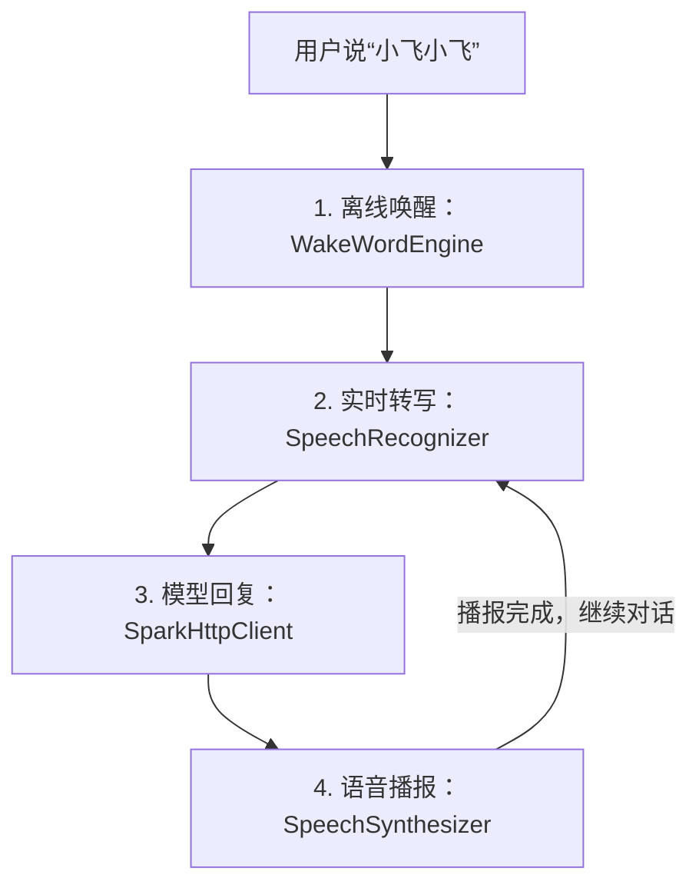

# Android 语音链路 Demo：从唤醒到播报的完整抽离

在一个桌面类 Android 项目里，语音助手经常会越写越“粘”：首页要显示状态，悬浮窗要同步状态，业务指令要启动系统设置，通话页面又要暂停麦克风。最后真正想复用的那条链路，反而被 Launcher 业务包住了。

**一句话结论：这次抽离的关键不是重写讯飞 SDK，而是把“唤醒、实时转写、星火回复、TTS 播报”放进一个独立页面和独立状态机，让 Demo 只表达语音链路本身。**

本文基于当前工程代码说明，Android 配置为 `minSdk 30`、`targetSdk 37`、`compileSdk 37`；语音能力来自本地 `AIKit.aar` 和 `SparkChain.aar`，星火对话回复走讯飞 OpenAI 兼容 HTTP 接口。具体 SDK 返回码和授权策略可能随讯飞版本变化，本文只解释当前项目里的实现边界。

## 1. 本文边界

这篇文章解释新增的独立 Demo 页面如何工作，以及它和原有语音助手服务的关系。

本文会讲：

- `MainActivity` 如何串起完整语音链路。
- `VoicePipelineDemoStateMachine` 为什么单独存在。
- `sdk` 目录下的语音能力封装如何被复用。
- 首页入口为什么先停止常驻语音服务。
- 星火模型返回和 TTS 播报之间的数据关系。

本文不展开讯飞 SDK 内部源码，也不讨论默认桌面、天气、环信通话、悬浮窗等业务模块。它们属于产品壳层，不是这次 Demo 的重点。

## 2. 全局地图：一条链路，四个能力

独立 Demo 的主流程可以看成四段：



唤醒词只负责开启第一轮对话。进入连续对话后，TTS 每次播完都会直接回到实时转写；只有用户退出对话或页面重新进入待命状态，才需要再次说唤醒词。

对应到文件职责：

| 代码位置 | 职责 |
| --- | --- |
| `MainActivity.kt` | 独立 Demo 页面和语音链路编排 |
| `VoicePipelineDemoStateMachine.kt` | Demo 专属 UI 状态，不依赖 Android SDK |
| `sdk/WakeWordEngine.kt` | AIKit 离线唤醒，“小飞小飞”命中后回调 |
| `sdk/SpeechRecognizer.kt` | SparkChain 在线实时转写，输出中间结果和最终结果 |
| `llm/SparkHttpClient.kt` | 调用星火 OpenAI 兼容 HTTP 接口，拿到模型回复 |
| `sdk/SpeechSynthesizer.kt` | AIKit Aisound 离线 TTS，生成 PCM 并用 `AudioTrack` 播放 |

这也是这次抽离的边界：SDK 封装继续复用，Launcher 业务不进入 Demo。

## 3. 为什么先抽一个状态机

页面上需要展示当前阶段、识别文本和模型回复。如果直接在 Activity 里到处改 `TextView`，很快会变成“某个回调里改一个标题，另一个回调里忘了清空文本”的状态。

所以新增了 `VoicePipelineDemoStateMachine`。它不关心麦克风、Activity 生命周期，也不调用 SDK，只负责把语音链路推进成 UI 状态：

```kotlin
enum class VoicePipelineDemoPhase {
    STOPPED,
    INSTALLING,
    INITIALIZING,
    STANDBY,
    AWAKENED,
    LISTENING,
    THINKING,
    SPEAKING,
    ERROR,
}
```

例如一轮用户提问会经历：

```text
LISTENING  -> 正在实时转写，保存 transcript
THINKING   -> 带着 transcript 请求星火模型
SPEAKING   -> 保存 modelReply，交给 TTS 播报
LISTENING  -> 播报完成后继续听下一轮
```

这层状态机的好处是测试容易写。当前新增的 JVM 单测覆盖了两个关键行为：识别文本会被带到星火思考和 TTS 播报阶段；回到待唤醒时会清理上一轮文本。它测的是页面规则，不需要启动 Android 设备，也不需要真实麦克风。

## 4. 独立工程：只保留一条语音链路

这次最终交付不是在 `robot` 工程里新增页面，而是在同级目录 `voice-pipeline-demo` 下新建一个独立 Android 工程。它有自己的 `settings.gradle.kts`、`app/build.gradle.kts`、`AndroidManifest.xml`、AAR、assets 和入口 Activity。

这个拆法有两个好处。

第一，Demo 不再依赖 Launcher 的生命周期。它启动后只处理自己的权限、资源复制、SDK 初始化、唤醒监听、实时转写、星火请求和 TTS 播报。

第二，AIKit 和 SparkChain 这类进程级运行时只由 Demo 自己管理。页面不可见或销毁时，`MainActivity` 会释放唤醒、ASR、SparkChain、TTS 和 AIKit 资源，避免麦克风或全局 SDK 实例残留。

因此，`robot` 工程里的常驻 `VoiceAssistantService` 不再参与这个 Demo。原项目可以继续保持自己的桌面语音助手；新工程负责提供最小可运行、便于讲解和二次迁移的语音链路样板。

## 5. Demo 初始化：资源、AIKit、SparkChain

`MainActivity.startDemo()` 做三件事。

第一步，释放 APK 里的离线资源：

```kotlin
val installer = ResourceInstaller(this)
installer.installIfNeeded { progress ->
    publish(stateMachine.installing(progress))
}
```

`ResourceInstaller` 会把 `assets/iflytek/ivw` 和 `assets/iflytek/aisound` 复制到应用私有目录。唤醒和 TTS 都依赖这些本地模型。

第二步，初始化 AIKit：

```kotlin
val newRuntime = AIKitRuntime(applicationContext, installer.workDir)
newRuntime.initialize { result -> ... }
```

AIKit 负责离线唤醒和离线 TTS。密钥不写在仓库里，而是从 `local.properties` 注入到 `BuildConfig`。

第三步，初始化 SparkChain：

```kotlin
val newSparkRuntime = SparkChainRuntime(applicationContext)
val sparkResult = newSparkRuntime.initialize()
```

SparkChain 在当前项目里只用于中文大模型实时转写。真正的星火“模型回复”不是这个 AAR 里的 LLM 页面，而是 `SparkHttpClient` 通过 HTTP 请求拿到。

初始化完成后，Activity 创建三个引擎：

```kotlin
wakeEngine = WakeWordEngine(...)
recognizer = SpeechRecognizer(...)
synthesizer = SpeechSynthesizer(...)
```

然后进入 `STANDBY`，等待“小飞小飞”。

## 6. 唤醒：从待命到第一句 TTS

待唤醒阶段由 `WakeWordEngine.start()` 开启。它内部使用 `PcmRecorder` 持续采集 `16k/16bit/mono` PCM，然后通过 AIKit IVW 能力写入唤醒引擎。

当 SDK 回调里出现 `func_wake_up` 或 `func_pre_wakeup` 时，`WakeWordEngine` 触发 `onWake()`。Demo 页面收到后执行：

```kotlin
wakeEngine?.stop()
conversationActive = true
publish(stateMachine.awakened(WakeWordEngine.WAKE_WORD))
speak("我在，请讲") { startListening() }
```

这里有一个重要细节：唤醒命中后先停止唤醒录音，再进入 TTS。否则同一个页面内也会出现唤醒录音和识别录音互相争用的问题。

“我在，请讲”播完以后，才进入实时转写。

## 7. 实时转写：中间结果用于页面反馈，最终结果用于请求星火

`SpeechRecognizer` 来自原项目对 SparkChain ASR 的封装。它做的事情很明确：

- `start()` 创建一轮 ASR 会话。
- `PcmRecorder` 把麦克风 PCM 持续写给 SparkChain。
- `onPartial` 返回中间识别文本，用来实时刷新页面。
- `onFinal` 返回最终文本，用来进入星火请求。

Demo 里的处理逻辑是：

```kotlin
private fun handlePartial(text: String) {
    if (!conversationActive || text.isBlank()) return
    publish(stateMachine.listening(text))
}
```

中间结果只更新 UI，不触发模型请求。最终结果才进入 `handleRecognized()`：

```kotlin
val text = rawText.trim()
if (text.isBlank()) {
    startListening()
    return
}
if (isDemoExit(text)) {
    conversationActive = false
    speak("好的，语音 Demo 已回到待唤醒") { enterStandby() }
    return
}
askSpark(text)
```

这样页面可以实时看到用户说了什么，但不会因为每个中间字词都去请求模型。

## 8. 星火回复：HTTP 模型返回适合 TTS 的短文本

当前项目里的星火对话客户端是 `SparkHttpClient`。它调用的是：

```text
https://spark-api-open.xf-yun.com/v1/chat/completions
```

鉴权使用 `Authorization: Bearer <APIPassword>`，配置项是 `local.properties` 里的 `iflytek.sparkApiPassword`。请求体由 `SparkHttpRequestBuilder` 构造，默认非流式返回，方便后续 TTS 一次性播报完整句子。

Demo 里没有再经过 `IntentRouter`，因为这个页面不演示“打开设置”这类本地业务指令。它直接请求星火：

```kotlin
val client = SparkHttpClient()
val snapshot = synchronized(history) { history.toList() }
client.chat(text, snapshot)
    .onSuccess { rememberTurn(text, it) }
    .getOrElse { "星火大模型暂时没有返回成功结果，请稍后再试" }
```

`history` 只保留最近 8 条消息，目的是让连续对话有一点上下文，同时避免请求体无限增长。模型回复拿到后，Activity 进入 `SPEAKING` 状态。

如果没有配置 `iflytek.sparkApiPassword`，页面不会崩溃，而是直接给出可播报的提示语。这是 Demo 很重要的体验边界：配置缺失是可诊断状态，不应该变成空白页面。

## 9. TTS 播报：合成结束不等于播放结束

`SpeechSynthesizer` 封装的是 AIKit Aisound 离线 TTS。它不是简单地“合成完就回调完成”，而是做了两层处理。

第一层，SDK 回调里的 PCM 不直接在回调线程播放，而是放入独立播放线程：

```kotlin
playbackExecutor.execute {
    writePcmOnPlaybackThread(speechContext, bytes)
}
```

这样可以避免 `AudioTrack.write()` 阻塞 SDK 回调线程。

第二层，SDK 通知合成结束后，还要等 `AudioTrack` 队列里的 PCM 真正播完：

```kotlin
delayMs = remainingPlaybackMsLocked(track) + PLAYBACK_DRAIN_MARGIN_MS
main.postDelayed(runnable, delayMs)
```

这个细节很容易被忽略。对用户来说，“播报完成”是耳朵听完，不是 SDK 不再产出 PCM。如果提前释放 `AudioTrack`，短句尾部可能被吞掉。

Demo 页面调用 TTS 的方式很轻：

```kotlin
private fun speak(text: String, onComplete: () -> Unit) {
    publish(stateMachine.speaking(text))
    synthesizer?.speak(text) { main.post(onComplete) }
        ?.onFailure { handleEngineError(it.message.orEmpty()) }
}
```

星火回复播完后，`onComplete` 继续调用 `startListening()`，形成连续对话。

## 10. 易混点：SparkChain ASR 和星火 HTTP 不是同一层

这次抽离里最容易混的概念，是“SparkChain”和“星火模型返回”。

在当前项目中：

| 名称 | 当前用途 | 输入 | 输出 |
| --- | --- | --- | --- |
| `SparkChainRuntime` | 初始化 SparkChain SDK | AppId、ApiKey、ApiSecret | 可用的 ASR 运行时 |
| `SpeechRecognizer` | 实时转写 | 麦克风 PCM | 中文识别文本 |
| `SparkHttpClient` | 星火对话回复 | 用户文本和历史消息 | 适合播报的回复文本 |

也就是说，SparkChain AAR 负责“把声音变成文字”；`SparkHttpClient` 负责“把文字交给大模型生成回复”。这两个步骤都和讯飞有关，但在代码里是两条不同通道。

把这层边界说清楚以后，Demo 的结构就很直观：ASR 返回 `transcript`，HTTP 返回 `modelReply`，TTS 播放 `modelReply`。

## 11. 实践意义

这个 Demo 的价值不只是多了一个页面，而是把语音能力变成了可以单独验证、单独讲解、单独演示的模块。

对开发来说，它减少了排查成本。语音链路出问题时，可以先进入 Demo 页面确认：是资源复制失败、AIKit 鉴权失败、SparkChain ASR 没结果、星火 HTTP 没配置，还是 TTS 播放异常。

对产品来说，它把 Launcher 的业务判断拿掉了。Demo 不会打开设置，不会显示天气，不会处理环信通话，只回答一个问题：从唤醒到播报这条链路是否跑通。

对后续重构来说，它也给了一个清晰方向：底层 SDK 封装可以被单独搬迁到新工程，业务态服务和演示态页面各自维护自己的状态机。共享能力，不共享页面状态。

## 12. 收束

回到最开始的问题：如何把“语音唤醒 + 实时转写 + 星火模型返回 + TTS 播报”从桌面助手里抽出来？

答案不是复制一份大服务，而是分三层：

- 底层能力复用：`WakeWordEngine`、`SpeechRecognizer`、`SparkHttpClient`、`SpeechSynthesizer`。
- Demo 编排独立：`MainActivity` 只管理语音链路。
- UI 状态独立：`VoicePipelineDemoStateMachine` 只描述 Demo 页面该显示什么。

**这次抽离的核心，是让 Demo 只保留语音链路本身：唤醒负责开始，ASR 负责听懂，星火负责回答，TTS 负责说出来。**
